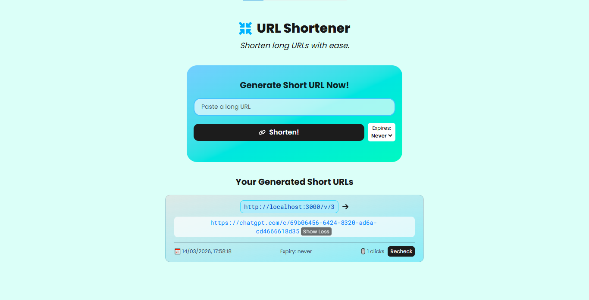
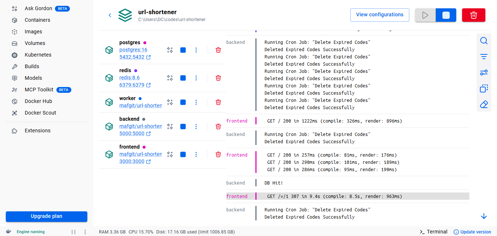

# URL Shortener (In Progress)

> Basic URL shortener to learn Docker, Job-Queue System & some related system design concepts & tools.

## Table of Contents

- [Tools and Concepts](#tools-and-concepts)
- [Screenshots](#screenshots)
- [How to Run](#how-to-run)

## Tools and Concepts

- Docker ✅
    - Learnt and made Dockerfiles and docker-compose.yml file with detailed comments on what I learnt
- Basic Rate Limiting ✅
    - Used Redis's INCR and EX operators for that in an Express middleware
- BullMQ (Redis-Based Queue System) ✅
    - For queuing jobs so that a worker can pick it up and run it separately
    - So that response is sent to the user immediately, and then the database queries afterwards would handled by the worker instead of doing all that in the network request before sending response to user.
    - Alternative: setImmediate in Node.js but it isn't as effective as BullMQ, which can handle retries and queue and worker management, and other stuff.
- Nginx ✅
- Horizontal Scaling & Load Balancing ✅
- Cron Job ✅
    - For scheduling deletion of expired short urls from PostgreSQL
- Redis + PostgreSQL ✅
- Next.js + Express.js ✅
- AWS (EC2 instance basics) ✅
<!-- - Read Replica -->

## Screenshots

Frontend:

Docker:

[DockerHub Profile](https://hub.docker.com/r/mafgit/)

## How to Run

1. Have Docker desktop installed
1. Just download these files in a folder (or clone the whole repo if you want):
    - docker-compose.yml
    - nginx.conf
    - schema.sql
1. `docker compose up` in the terminal inside the folder
1. When all services are ready, visit `http://localhost`